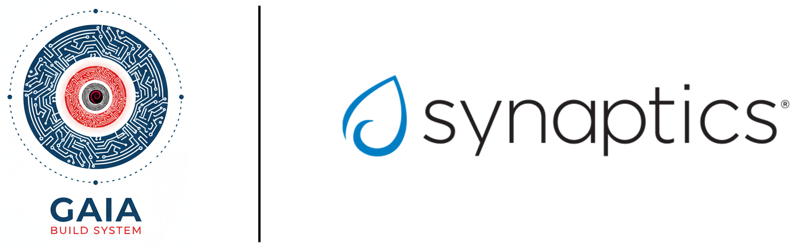

# Cookbook for Synaptics Astra

<p align="center">
    
</p>

This cookbook provides a collection of recipes to help you get started with DeimOS for Synaptics Astra.


## Supported Boards -> Machines

| Board                      | Gaia Machine Name   |
|----------------------------|---------------------|
| Synaptics Astra sl2619     | sl2619              |
| Synaptics Astra sl1680     | sl1680              |
| Toradex Luna sl1680 SBC    | luna                |


## Prerequisites

- [Gaia project Gaia Core](https://github.com/gaiaBuildSystem/gaia);

## Build an Image

```bash
./gaia/bitcook --buildPath /home/user/workdir --distro ./cookbook-synaptics/distro-ref-astra-dolphin.json --noCache
```

This will build DeimOS for Synaptics Astra sl1680.
